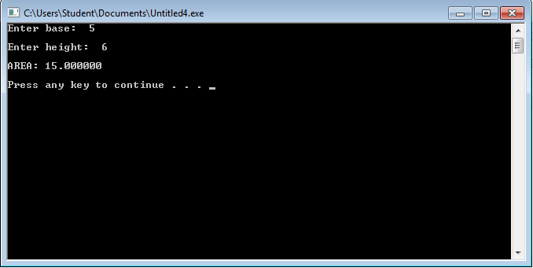
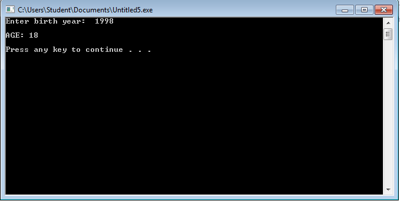
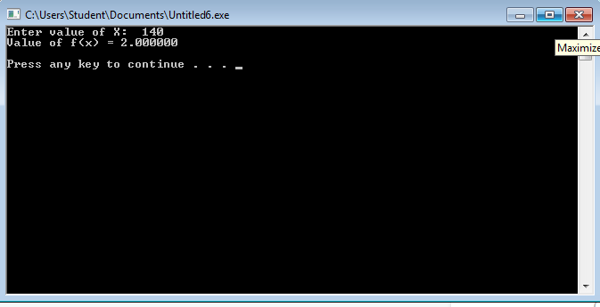

# Activity1-TanM
# Activity 1 - Name and course
```
#include <stdio.h>
#include <stdlib.h>
                                        
int main()
{
	printf("@@@@@@@@@@@@@@@@@@@@@@@@@@@@@@@@@@@@@@@@@@");
	printf("\n         Mharela Angela A. Tan      \n                BS ECE ");
	printf("\n                ID NUMBER           \n              May 26, 2016");
	printf("\n           e-mail address            \n                MOBILE NUMBER");
	printf("\n@@@@@@@@@@@@@@@@@@@@@@@@@@@@@@@@@@@@@@@@@@\n\n");
	
	system ("PAUSE");
}
```


# Activity 1 - Triangle Area

```
#include <stdio.h>
#include <stdlib.h>
                                        
int main()
{
	float base, height, area;
	printf("Enter base:  ");
	scanf("%f", &base);
	printf("\nEnter height:  ");
	scanf("%f",&height);
	area = (base*height)/2;
	
	printf("\nAREA: %f\n\n", area);
	
	system ("PAUSE");
}
```


# Activity 1 - Age
```
#include <stdio.h>
#include <stdlib.h>
                                        
int main()
{
	int year, age;
	printf("Enter birth year:  ");
	scanf("%d", &year);
	age = 2016-year;
	
	printf("\nAGE: %d\n\n", age);
	system ("PAUSE");
}
```


# Activity 1 - Value of f(x)
```
#include <stdio.h>
#include <stdlib.h>
                                        
int main()
{
	float x, ans;
	printf("Enter value of X:  ");
	scanf("%f", &x);
	ans= x/70;
	printf("Value of f(x) = %f\n\n", ans);
	
	system ("PAUSE");
}
```

